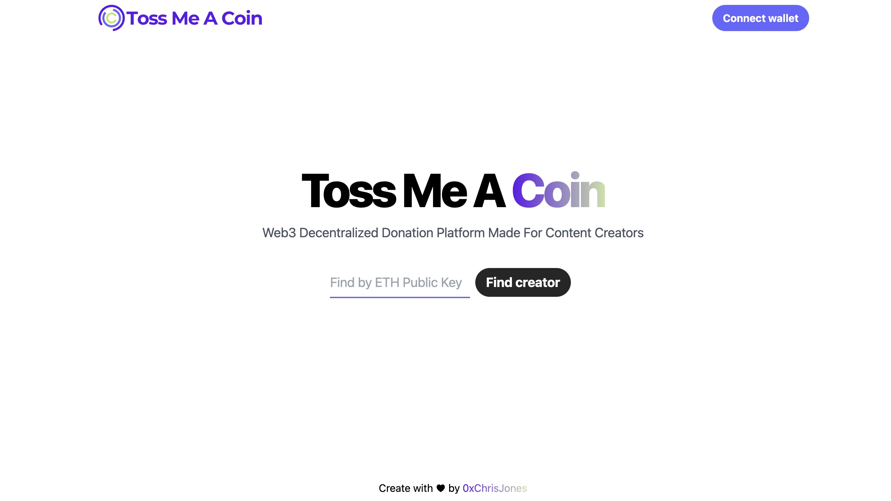

# TossMeACoin

A Web3 Decentralized Applications that allows users to send personalized ETH donations with custom name and message. Created on the Ropsten Test Network.

All of the donations are stored entirely on the blockchain and will be displayed to their sender/receiver once they connect their wallet.

Users can also choose to create their own custom profiles, where they can choose an NFT as their profile pic and create custom name & bio that is stored in a Mongodb DB via GraphQL Server. These profiles can then be shared with their audience to be able to receive donations in ETH.
